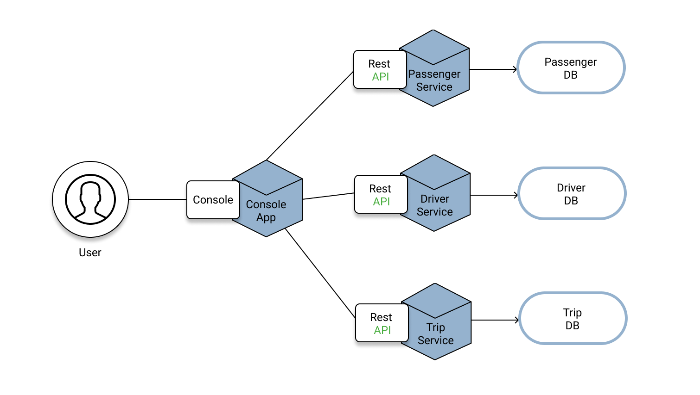

<!-- TABLE OF CONTENTS -->
## Table Of Contents
<ol>
  <li>
    Introduction
  </li>
  <li>
    Design considerations
  </li>
  <li>
     Architecture diagram
  </li>
  <li>
     Structs
  </li>
   <li>
    Passenger Microservice
  </li>
  <li>
    Driver Microservice
  </li>
  <li>
    Trip Microservice
  </li>
  <li>
    Setting up database
  </li>
  <li>
    Running the program
  </li>
</ol>

<!-- INTRODUCTION -->
## Introduction
Hi, I am Yap Zhao Yi, the developer of this repository, the codes provided are intended for Ngee Ann Polytechnic's Emerging IT Trends module, october semester 2021. The codes covers the creation of a ride hailing app. Additionally, as per the content page, explanation will be given for the design considerations, architecture diagram and various microservices functionality. 

<!-- DESIGN CONSIDERATIONS -->
## Design Considerations
Due to the nature of the assignment, the microservices are deployed locally without containerization, hence microservices while optimally deployed as seperate packages to minimize dependencies, are all instead written under main to allow visual studio code to recognize it as an executable. However, to account for this, go modules have been initalized as part of each microservice. Additionally, due to a lack of containerization and in turn a dedicated DBMS, a single database is also utilized despite seperate databases being more preferable when implementing micro services.

Through tactical domain driven design, persistant entities such as trips, passengers and drivers are recognized. It is also noted that no stand alone value objects have been identified. Due to the simplicity of the assignment, no further aggregation is neccessary. 

The simplificity of the assignment only requires for a single console app, rather than dedicated console micro services for the passenger and driver. Furthermore, it is notable that all services are designed to be cohesive and loosely coupled, with much of the api http methods being for targeted purposes as well through the use of parameters. All http calls without their neccessary parameters will be rejected as a part of "404 Required parameters not found".

<!-- ARCHITECTURE DIAGRAM -->
## Architecture Diagram
 

  

 
As seen here, passenger service, driver service and trip service are offered to provide RESTful Api Methods to the console application, each service has their own individual databases which is represented by the tables in the "asg1" database due to a lack of a DBMS and containerization.

<!-- Structures -->
## Structs
These struct declarations are critical in understanding how the data is laid out, do note that PassengerID and DriverID are not defined as foreign keys in the database but are rather used as identifiers. Hence, there is no relations between the entities.

 
type Passenger struct {  
	PassengerID  int  
	Username     string //Unique  
	Password     string //(Not Retrieved)  
	FirstName    string  
	LastName     string  
	MobileNo     string //varchar(8)  
	EmailAddress string //Unique  
}  
 
type Driver struct {  
	DriverID        int  
	Username        string //Unique  
	Password        string //(Not Retrieved)  
	FirstName       string  
	LastName        string  
	MobileNo        string //varchar(8)  
	EmailAddress    string //Unique  
	NRIC            string //1 letter, 7 digits, 1 checksum letter, Unique (Not Retrieved)  
	CarLicencePlate string //S, 2 letters, 4 numbers, 1 checksum letter, Unique  
	Status          string  
}  
 
type Trip struct {  
	TripID      int  
	PickUp      string //char(6)  
	DropOff     string //char(6)  
	DriverID    int  
	PassengerID int  
	Status      string  
}  
 
// struct to track user's current and past decisions  
type Session struct {  
	Usertype         string  
	BreadCrumbOption []string  
	BreadCrumbMenu   []string //Last item is the user's current menu location  
}  

<!-- Passenger Microservice -->
## Passenger Microservice

<ol>
    <li>
        POST: /api/v1/passengers  
        Create a new passenger account 
    </li>
    <li>
        GET: /api/v1/passengers?username={username}&password={password}  
        Gets a passenger account based on username and password provided
    </li>  
	The following are for a single instance for passenger defined by their passenger id hence having a different url:     
    <li>
        GET: /api/v1/passengers/{passengerid}  
        Gets passenger account with the passenger id provided
    </li>
    <li>
        PUT: /api/v1/passengers/{[passengerid}  
        Updates passenger account with the passenger id provided
    </li>
    <li>
        DELETE: /api/v1/passengers/{passengerid}  
        Deletes passenger account with the passenger id provided
    </li>
 </ol>
 
 <!-- Driver Microservice -->
## Driver Microservice
Note for list item 2 and 3, due to it having the same url and method without their query strings, a helper function helps recognize the different combination of parameters passed in and triggers the appropriate function.  
<ol>
    <li>
        POST: /api/v1/drivers  
        Create a new driver account  
    </li>
    <li>
        GET: /api/v1/drivers?username={username}&password={password}  
        Gets a driver account based on username and password provided  
    </li> 
     <li>
        GET: /api/v1/drivers?status={status}  
        Gets all driver accounts with the status provided  
    </li>  
	The following are for a single instance for driver defined by their driver id hence having a different url:     
    <li>
        GET: /api/v1/drivers/{driverid}  
        Gets driver account with the driver id provided  
    </li>
    <li>
        PUT: /api/v1/drivers/{driverid}  
        Updates driver account with the driver id provided  
    </li>
    <li>
        DELETE: /api/v1/drivers/{driverid}  
        Deletes driver account with the driver id provided  
    </li>
 </ol>
 
<!-- Trip Microservice -->
## Trip Microservice
Note for list item 2, 3 and 4, due to it having the same url and method without their query strings, a helper function helps recognize the different combination of parameters passed in and triggers the appropriate function.  
<ol>
    <li>
        POST: /api/v1/trips  
        Create a new trip record  
    </li>
    <li>
        GET: /api/v1/trips?passengerid={passengerid}&status={status}  
        Gets a passenger's current active trip record  
    </li>
    <li>
        GET: /api/v1/trips?driverid={driverid}&status={status}  
        Gets a driver's current active trip record  
    </li>
    <li>
        GET: /api/v1/trips?passengerid={passengerid}  
        Gets a passenger's trip history (in chronological order)
    </li>
	 
	The following are for a single instance for trip defined by trip id hence having a different url:    
    <li>
        GET: /api/v1/trips/{tripid}  
        Gets trip record with the trip id provided  
    </li>
    <li>
        PUT: /api/v1/trips/{tripid}  
        Updates trip record with the trip id provided  
    </li>
    <li>
        DELETE: /api/v1/trips/{tripid}  
        Delete trip account with the trip id provided  
    </li>
 </ol>
 
 <!-- SETTING UP DB -->
## Setting up database
<ol>
    <li>
        Using sql workbench, create a new connection of Hostname: "127.0.0.1" and Port: "3306"
    </li>
    <li>
        Run the query located in the file "SetupAuthorizedUser".sql
    </li>
    <li>
        Run the query located in the file "CreateDatabase".sql, note that the 3 insert queries are intended to populate the database with sample data and is hence not neccessary.
    </li>
 </ol>

 <!-- Running the program -->
## Running the program
<ol>
    <li>
        Set up the database if one has yet to do so (see above section)
    </li>
    <li>
        Download the 'Asg1' folder from the repository and store it under your go language's src folder. (Ensure you have the relevant extensions for go)
    </li>
    <li>
        Open up 4 seperate command prompts in visual studio code
    </li>
    <li>
        For the first command prompt, change the directory to the 'PassengerService' folder i.e 'cd src/Asg1/PassengerService'
    </li>
    <li>
        For the second command prompt, change the directory to the 'DriverService' folder i.e 'cd src/Asg1/DriverService'
    </li>
    <li>
        For the third command prompt, change the directory to the 'TripService' folder i.e 'cd src/Asg1/TripService'
    </li>
    <li>
        For the fourth command prompt, change the directory to the 'Console' folder i.e 'cd src/Asg1/Console'
    </li>
    <li>
        Run the command line 'go run main.go' for all the first three command prompts before running the same line for the 'Console' command prompt. This is to ensure that           the three services are deployed and ready to listen  to the API calls from the Console. 
    </li>
 </ol>
